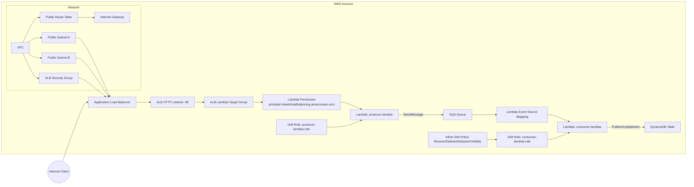

# AWS Resource Interactions

This document lists all AWS resources managed in this Terraform project and shows how they interact with each other.

## PNG export

Generate a PNG locally from the Mermaid source:

```bash
npx -y @mermaid-js/mermaid-cli -i docs/aws-resource-interactions.mmd -o docs/aws-resource-interactions-diagram.png -b white -t default
```

After generating, open:

- `docs/aws-resource-interactions-diagram.png`

## End-to-end flow

1. Client sends HTTP request to the internet-facing ALB.
2. ALB listener forwards to a Lambda target group.
3. ALB is permitted to invoke `producer-lambda`.
4. `producer-lambda` writes messages to SQS using `SQS_QUEUE_URL`.
5. SQS triggers `consumer-lambda` through an event source mapping.
6. `consumer-lambda` processes events and writes to DynamoDB.

## Interaction diagram



## Resource interaction matrix

| Resource | Type | Interacts With | Interaction |
|---|---|---|---|
| `aws_vpc.this` | VPC | Subnets, route table, security group, IGW | Network boundary for all ALB networking resources |
| `aws_subnet.public[*]` | Subnet | ALB, route table association | Hosts internet-facing ALB nodes |
| `aws_internet_gateway.this` | Internet Gateway | Public route table | Provides internet egress/ingress path |
| `aws_route_table.public` | Route Table | IGW, subnet associations | Routes `0.0.0.0/0` to IGW |
| `aws_route_table_association.public[*]` | Route Assoc | Public subnets + route table | Makes subnets truly public |
| `aws_security_group.alb` | Security Group | ALB | Allows inbound HTTP 80 and all egress |
| `aws_lb.this` | ALB | Public subnets, ALB SG, listener | Internet entry point |
| `aws_lb_listener.http` | Listener | ALB, target group | Forwards HTTP requests to lambda target group |
| `aws_lb_target_group.lambda` | Target Group (lambda) | Listener, producer lambda permission | Source of ALB invoke permission scope |
| `aws_iam_role.this` (producer) | IAM Role | producer lambda | Trusts Lambda service |
| `aws_iam_role_policy_attachment.basic_execution` (producer) | IAM Policy Attachment | producer role | CloudWatch logs permissions |
| `aws_lambda_function.this` (producer) | Lambda | Producer role, SQS queue URL env var | Handles ALB requests and pushes messages to SQS |
| `aws_lambda_permission.alb_invoke` | Lambda Permission | Producer lambda, ALB target group ARN | Authorizes ALB to invoke producer lambda |
| `aws_sqs_queue.this` | SQS Queue | Producer lambda, consumer event source mapping, consumer role policy | Buffer between producer and consumer |
| `aws_iam_role.this` (consumer) | IAM Role | consumer lambda | Trusts Lambda service |
| `aws_iam_role_policy_attachment.basic_execution` (consumer) | IAM Policy Attachment | consumer role | CloudWatch logs permissions |
| `aws_iam_role_policy.sqs_access` | Inline IAM Policy | consumer role, SQS queue ARN | Grants SQS poll/delete/visibility permissions |
| `aws_lambda_function.this` (consumer) | Lambda | Consumer role, DynamoDB env var, SQS event source mapping | Processes SQS messages |
| `aws_lambda_event_source_mapping.sqs` | Event Source Mapping | SQS queue ARN, consumer lambda | Polls SQS and invokes consumer lambda |
| `aws_dynamodb_table.this` | DynamoDB | consumer lambda | Persistent storage target |

## Module wiring overview

- `module.network` exports `vpc_id`, `public_subnets`, and `alb_security_group_id` to `module.alb`.
- `module.alb` exports `target_group_arn` to `module.producer_lambda` for `aws_lambda_permission`.
- `module.sqs` exports:
  - `queue_url` to `module.producer_lambda` (environment variable).
  - `queue_arn` to:
    - `module.consumer_lambda` (event source mapping).
    - `module.consumer_lambda_role` (SQS IAM policy scope).
- `module.consumer_lambda` gets DynamoDB table name via env var from `module.dynamodb`.

## Notes

- This repo currently provisions ALB, listener, and lambda target group, and grants ALB invoke permission to producer Lambda.
- If not already present in your runtime/app stack, you may still need explicit Lambda target registration in the target group depending on deployment approach.
